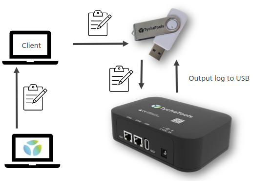
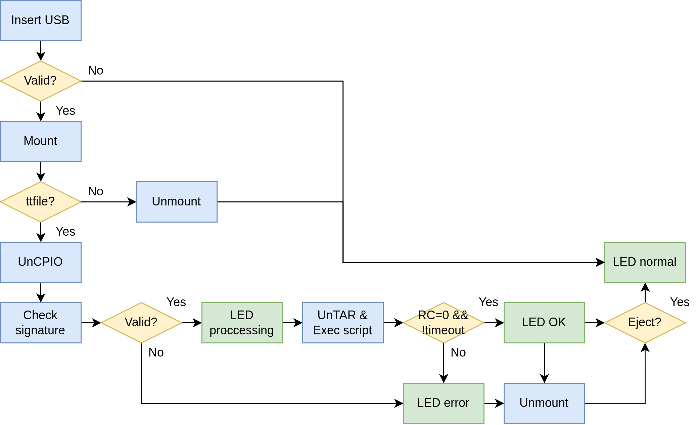
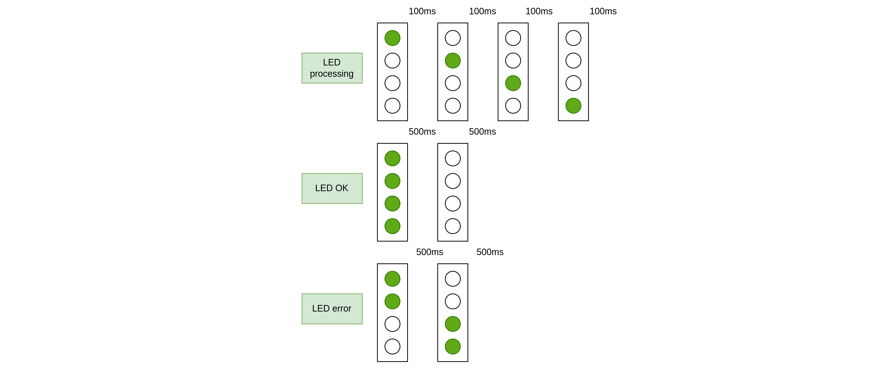

# USB autorun

USB autorun is a tool to perform automatized tasks in TycheTools Heimdall using a USB flash drive.
These automatized tasks may include the following:

* Update Heimdall's software.
* Copy a file from Heimdall.
* Run a script in Heimdall.

## Dependencies

* CPIO (Arch Linux: ```sudo pacman -S cpio```)

## Diagrams

The following diagram shows how the tool works:
1. A script is created with the desired files. In addition, a signature is added so that these files can only be generated by TycheTools.
2. Insert the USB stick into Heimdall.
3. Heimdall will automatically run the script if the signature is valid. Once the operation is finished, it will inform the user using the LEDs.
4. The USB flash drive is removed from Heimdall.



The following is a flow chart with the process in more detail and the status of the Heimdall LEDs.



The behavior of the LEDs according to the status of the tool is shown in the following figure.



## How to generate an image

1. Generate an ```INSERT_SCRIPT```
    Insert script example (in.sh):
    ```echo "Hello, world!"```
2. Generate an ```EJECT_SCRIPT```
    Eject script example (out.sh):
    ```echo "Bye, world!"```
3. Generate file. This command will generate a ```ttfile.bin```
    ```./build_autorun.sh -k <PEM_CERTIFICATE> -s <INSERT_SCRIPT> -o <EJECT_SCRIPT> -f <FILE(S)>```
    File generation example:
    ```./build_autorun.sh -k private.pem -s in.sh -o out.sh```
    The files of the generated binary can be viewed with:
    ```cpio -t < ttfile.bin```
4. Copy the generated file to an USB stick.

## How it works

There are the following files:

* ```build_autorun.sh```. An script that generates a valid file. Run in host. ```Usage: ./build_autorun.sh -k <PEM_CERTIFICATE> -s <INSERT_SCRIPT> -o <EJECT_SCRIPT> -f <FILE(S)>```
* ```usb_mount.sh```. An script that mounts or unmount a device. Is called by ```usb_autorun.sh```. ```Usage: ./usb_mount.sh {add|remove} <DEVICE_NAME (e.g. sdb1)>```
* ```usb_autorun.sh```. Main script. Runs in Heimdall.
* ```99-usb-autorun.rules```. Calls ```usb_autorun.sh``` when an USB stick is inserted or extracted for automatic usage.

### Automatic mode

Copy ```99-usb-autorun.rules``` in rules directory ```cp 99-usb-autorun.rules /etc/udev/rules```

